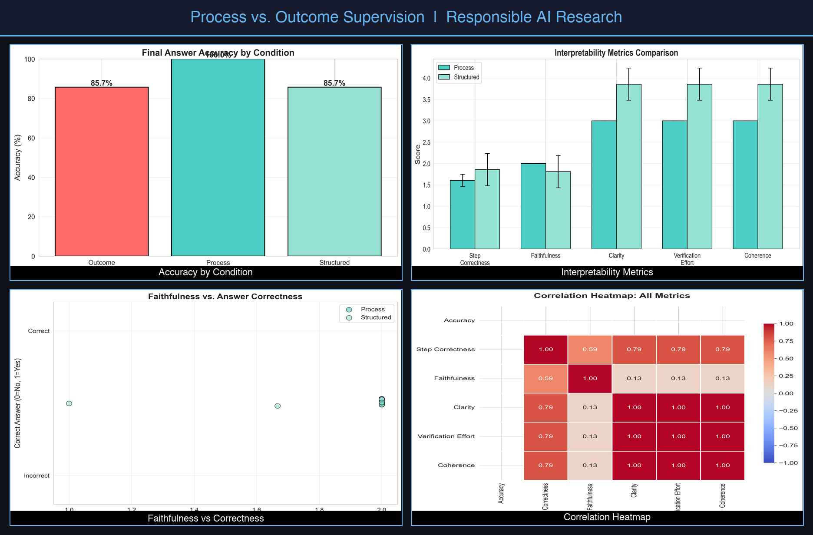
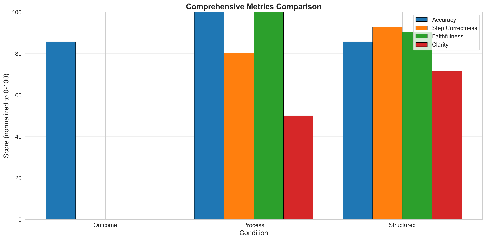

# Process vs. Outcome Supervision for Trustworthy LLM Reasoning



A comprehensive research project evaluating process-based supervision versus outcome-based supervision in LLM reasoning, with implications for legal and regulatory compliance.

## 📋 Project Overview

**Research Question**: How do process-based explanations (step-by-step reasoning) compare to outcome-only supervision in terms of:
- ✅ Factual reliability (accuracy)
- 🔍 Interpretability and auditability
- ⚖️ Legal/regulatory compliance implications

**Dataset**: GSM8K (Grade School Math 8K) - 150-200 problems

**Timeline**: 6 weeks

**Status**:
- ✅ Phase 1: Data Collection (COMPLETED)
- ✅ Phase 3: Interpretability Annotation (PARTIAL — 7 problems)
- ✅ Phase 4: Statistical Analysis & Visualizations (COMPLETED)
- 🔄 Phase 2 & Full Annotation: In Progress

---

## 📊 Results Preview

### Accuracy by Condition


### Interpretability Metrics (Process vs. Structured)


### Faithfulness vs. Answer Correctness


### Comprehensive Metrics Summary



### Correlation Heatmap (All Metrics)


---

## 🚀 Quick Start

### 1. Setup Environment

```bash
# Install dependencies
pip install -r requirements.txt

# Configure API keys (create .env file)
cp .env.example .env
# Edit .env with your API keys
```

### 2. Run All Phases

```bash
cd code
python run_all_phases.py
```

This will:
- Generate error and hallucination analysis templates
- Pause for manual annotation ⏸️
- Generate interpretability annotation templates
- Pause for deep annotation ⏸️
- Calculate all metrics
- Generate visualizations
- Create final report

**Total Time**: ~30 min automated + ~15-20 hours manual annotation

---

## 📁 Project Structure

```
resp_ai/
├── code/                          # All implementation scripts
│   ├── prepare_dataset.py         # ✅ Phase 1.1
│   ├── generate_responses.py      # ✅ Phase 1.2
│   ├── extract_answers.py         # ✅ Phase 1.3
│   ├── calculate_metrics.py       # ✅ Phase 1.4
│   ├── phase2_error_analysis.py   # Phase 2.1
│   ├── phase2_hallucination_detection.py  # Phase 2.2
│   ├── phase3_sample_selection.py # Phase 3.1
│   ├── phase3_calculate_interpretability.py  # Phase 3.2
│   ├── phase4_statistical_analysis.py  # Phase 4.1
│   ├── phase4_visualizations.py   # Phase 4.2
│   ├── phase4_qualitative_analysis.py  # Phase 4.3
│   ├── phase5_report_generator.py # Phase 5
│   └── run_all_phases.py          # 🎯 Master script
│
├── data/
│   ├── dataset_manifest.csv       # ✅ Selected problems
│   ├── raw/
│   │   └── responses.jsonl        # ✅ Raw model responses
│   ├── processed/
│   │   ├── responses_with_answers.jsonl  # ✅ Extracted answers
│   │   ├── error_analysis.jsonl   # Error annotations
│   │   ├── hallucination_analysis.jsonl  # Hallucination annotations
│   │   └── failure_case_analysis.jsonl  # Case studies
│   └── annotations/
│       └── deep_annotation_sample.jsonl  # Deep annotations
│
├── results/
│   ├── accuracy_metrics.json      # ✅ Accuracy results
│   ├── error_type_statistics.json # Error distribution
│   ├── hallucination_statistics.json  # Hallucination rates
│   ├── interpretability_metrics.json  # Interpretability scores
│   ├── statistical_analysis.json  # Statistical tests
│   └── figures/                   # 📊 Visualizations (5 figures)
│
├── docs/
│   ├── IMPLEMENTATION_GUIDE.md    # 📖 Complete implementation guide
│   ├── ANNOTATION_GUIDE.md        # 📝 Detailed annotation instructions
│   ├── FINAL_REPORT.md            # 📄 Generated research report
│   └── project_implementation_plan_extracted.md  # Original plan
│
├── requirements.txt               # Python dependencies
├── .env.example                   # API key template
└── README.md                      # This file
```

---

## 📊 Implementation Phases

### ✅ Phase 1: Setup and Data Collection (COMPLETED)
You've already completed:
- Dataset preparation (150-200 problems)
- Response generation (3 conditions: outcome, process, structured)
- Answer extraction and normalization
- Basic accuracy calculation

**Results**:
- `results/accuracy_metrics.json`
- `data/processed/responses_with_answers.jsonl`

---

### 🔄 Phase 2: Error Analysis and Hallucination Detection

#### Phase 2.1: Error Type Analysis
```bash
cd code
python phase2_error_analysis.py
```

**What it does**: Samples 30-50 incorrect responses, creates annotation template

**Your task**: Annotate each error with type:
- `arithmetic`: Calculation mistake
- `conceptual`: Wrong approach
- `comprehension`: Misunderstood problem
- `incomplete`: Missing steps
- `formatting`: Parsing error

**Time**: ~2-3 hours

---

#### Phase 2.2: Hallucination Detection
```bash
python phase2_hallucination_detection.py
```

**What it does**: Samples 50 process/structured responses with automatic detection flags

**Your task**: For each response, identify if it contains hallucinations:
- `factual_error`: Objectively false statement
- `irrelevant`: Unrelated facts
- `inconsistent`: Self-contradictory
- `confabulation`: Made-up details

**Time**: ~2-3 hours

**See**: `docs/ANNOTATION_GUIDE.md` for detailed instructions

---

### 🔍 Phase 3: Interpretability Metrics

#### Phase 3.1: Sample Selection
```bash
python phase3_sample_selection.py
```

**What it does**: Selects 60 problems for deep annotation (stratified sampling)

**Output**: `data/annotations/deep_annotation_sample.jsonl`

---

#### Phase 3.2: Deep Annotation (MOST IMPORTANT)

**File**: `data/annotations/deep_annotation_sample.jsonl`

**Your task**: For each problem (60 × 2 conditions = 120 annotations):
1. Extract reasoning steps
2. Score each step (0-2): correctness and justification
3. Extract expert solution steps
4. Score alignment with expert (0-2)
5. Rate auditability (1-5 Likert): clarity, verification effort, coherence

**Time**: ~10-20 hours (5-10 min per problem)

**Critical**: This is the core of interpretability analysis

**See**: `docs/ANNOTATION_GUIDE.md` sections on deep annotation

---

#### Phase 3.3: Calculate Metrics
```bash
python phase3_calculate_interpretability.py
```

**What it does**: Calculates all interpretability metrics from your annotations

**Output**: `results/interpretability_metrics.json`

---

### 📈 Phase 4: Statistical Analysis and Visualizations

#### Phase 4.1: Statistical Analysis
```bash
python phase4_statistical_analysis.py
```

**What it does**:
- Paired t-tests (outcome vs process)
- Effect size calculations (Cohen's d)
- Summary statistics table

**Output**: `results/statistical_analysis.json`

---

#### Phase 4.2: Create Visualizations
```bash
python phase4_visualizations.py
```

**What it does**: Generates 5 publication-quality figures (300 DPI):
1. Accuracy comparison bar chart
2. Error type distribution (stacked bars)
3. Interpretability metrics comparison
4. Hallucination rates
5. Comprehensive summary

**Output**: `results/figures/*.png`

---

#### Phase 4.3: Qualitative Analysis
```bash
python phase4_qualitative_analysis.py
```

**What it does**: Identifies failure patterns, creates case study templates

**Your task**: Review and analyze ~40 case studies

**Time**: ~2-3 hours

---

### 📝 Phase 5: Report Generation

```bash
python phase5_report_generator.py
```

**What it does**: Generates comprehensive markdown report with:
- Executive summary
- Methodology
- Results with embedded figures
- Legal/regulatory implications
- Limitations and future work
- Conclusions

**Output**: `docs/FINAL_REPORT.md`

**Your task**:
1. Review and edit
2. Add case study details
3. Refine legal analysis
4. Add citations
5. Proofread

**Time**: ~2-3 hours

---

## 📖 Documentation

- **📘 Implementation Guide**: `docs/IMPLEMENTATION_GUIDE.md`
  - Complete step-by-step instructions
  - Troubleshooting
  - Time estimates

- **📝 Annotation Guide**: `docs/ANNOTATION_GUIDE.md`
  - Detailed annotation rubrics
  - Examples for each task
  - Quality check guidelines

- **📄 Final Report**: `docs/FINAL_REPORT.md`
  - Auto-generated research report
  - Edit and customize as needed

---

## ⏱️ Time Estimates

| Phase | Task | Automated | Manual | Total |
|-------|------|-----------|--------|-------|
| 1 | Data Collection | ✅ Done | - | - |
| 2.1 | Error Analysis | 5 min | 2-3 hrs | ~3 hrs |
| 2.2 | Hallucination | 5 min | 2-3 hrs | ~3 hrs |
| 3.1 | Sample Selection | 5 min | - | 5 min |
| 3.2 | **Deep Annotation** | - | **10-20 hrs** | **10-20 hrs** |
| 3.3 | Calculate Metrics | 5 min | - | 5 min |
| 4.1 | Statistical Analysis | 5 min | - | 5 min |
| 4.2 | Visualizations | 5 min | - | 5 min |
| 4.3 | Qualitative Analysis | 5 min | 2-3 hrs | ~3 hrs |
| 5 | Report Generation | 5 min | 2-3 hrs | ~3 hrs |
| **Total** | | ~50 min | ~20-30 hrs | **~25-30 hrs** |

---

## 🎯 Key Deliverables

Upon completion, you will have:

✅ **Quantitative Results**:
- Accuracy comparison across 3 conditions
- Statistical significance tests
- Error type distribution
- Hallucination rates
- Interpretability metrics (step correctness, faithfulness, auditability)

✅ **Visualizations**:
- 5 publication-quality figures
- Summary comparison charts

✅ **Qualitative Analysis**:
- ~40 detailed case studies
- Failure pattern taxonomy

✅ **Final Report**:
- 20-25 page markdown document
- Legal/regulatory implications analysis
- Ready for editing and submission

---

## 🛠️ Troubleshooting

### Missing Dependencies
```bash
pip install -r requirements.txt --upgrade
```

### File Not Found Errors
Always run scripts from the `code/` directory:
```bash
cd code
python phase2_error_analysis.py
```

### API Rate Limits
Adjust delays in `generate_responses.py` or switch models

### Annotation Overwhelming
Start with smaller samples - modify `SAMPLE_SIZE` in scripts

---

## 🎓 Next Steps After Completion

1. ✅ Review `docs/FINAL_REPORT.md`
2. ✅ Create presentation slides (15-20 slides)
3. ✅ Prepare for Q&A
4. ✅ Optional: Create interactive dashboard
5. ✅ Optional: Submit to workshop/conference

---

## 📚 Academic Context

This project addresses key questions in:
- **Responsible AI**: Trustworthy and interpretable AI systems
- **Algorithmic Accountability**: Auditability and human oversight
- **AI Regulation**: GDPR Article 22, EU AI Act compliance
- **Legal AI**: Implications for AI in high-stakes legal decisions

**Research Contribution**: Empirical evidence on the tradeoffs between process-based and outcome-based supervision, with direct policy implications.

---

## 📧 Support

For questions or issues:
1. Check `docs/IMPLEMENTATION_GUIDE.md`
2. Review `docs/ANNOTATION_GUIDE.md`
3. Check script docstrings and comments
4. Review example outputs in `results/`

---

## 📄 License

[Add your license here]

---

## 🙏 Acknowledgments

- GSM8K dataset: https://github.com/openai/grade-school-math
- Model providers: OpenAI/Anthropic/OpenRouter
- [Add other acknowledgments]

---

**Ready to complete your research project? Start with `code/run_all_phases.py`!** 🚀

